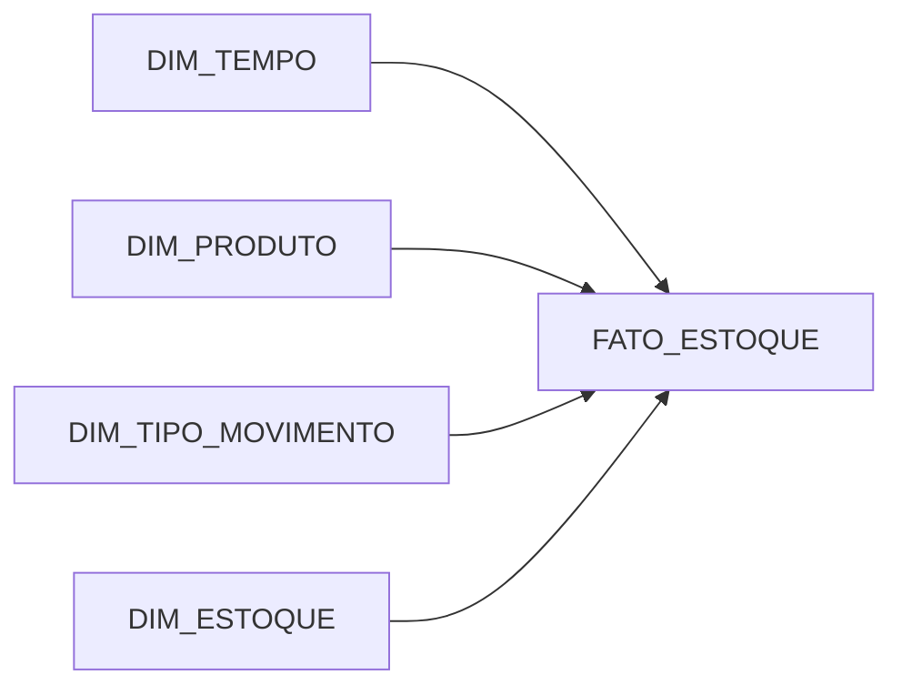

# Modelagem Dimensional - FATO_ESTOQUE

## Star Schema proposto

## Granularidade
Cada linha da `FATO_ESTOQUE` representa **1 movimento de estoque**.

## Dimensões reaproveitadas
- `DIM_TEMPO`
- `DIM_PRODUTO`

## Novas dimensões
- `DIM_TIPO_MOVIMENTO`
- `DIM_ESTOQUE`

## FATO_ESTOQUE - colunas, tipos e origem

| Coluna | Tipo | Origem |
|---|---|---|
| `SK_FATO_ESTOQUE` | NUMBER | Surrogate key do DW |
| `SK_TEMPO` | NUMBER | Lookup via `DAT_MOVIMENTO_ESTOQUE` |
| `SK_PRODUTO` | NUMBER | Lookup via `COD_PRODUTO` |
| `SK_TIPO_MOVIMENTO` | NUMBER | Lookup via `COD_TIPO_MOVIMENTO_ESTOQUE` |
| `SK_ESTOQUE` | NUMBER | Lookup via depósito derivado de `CP_ESTOQUE_PRODUTO` |
| `SEQ_MOVIMENTO` | NUMBER(15) | `CP_MOVIMENTO_ESTOQUE.SEQ_MOVIMENTO_ESTOQUE` |
| `QTD_MOVIMENTO` | NUMBER(10) | Quantidade transformada (+ entrada / - saída) |
| `STA_SAIDA_ENTRADA` | CHAR(1) | `CP_TIPO_MOVIMENTO_ESTOQUE.STA_SAIDA_ENTRADA` |

## DIM_TIPO_MOVIMENTO

| Coluna | Origem |
|---|---|
| `SK_TIPO_MOVIMENTO` | surrogate key |
| `COD_TIPO_MOVIMENTO_ESTOQUE` | `CP_TIPO_MOVIMENTO_ESTOQUE.COD_TIPO_MOVIMENTO_ESTOQUE` |
| `DES_TIPO_MOVIMENTO_ESTOQUE` | `CP_TIPO_MOVIMENTO_ESTOQUE.DES_TIPO_MOVIMENTO_ESTOQUE` |
| `STA_SAIDA_ENTRADA` | `CP_TIPO_MOVIMENTO_ESTOQUE.STA_SAIDA_ENTRADA` |

## DIM_ESTOQUE

| Coluna | Origem |
|---|---|
| `SK_ESTOQUE` | surrogate key |
| `COD_ESTOQUE` | `CP_ESTOQUE.COD_ESTOQUE` |
| `NOM_ESTOQUE` | `CP_ESTOQUE.NOM_ESTOQUE` |

## Regra de derivação do depósito
Como a tabela `CP_MOVIMENTO_ESTOQUE` não traz `COD_ESTOQUE`, o ETL usa `CP_ESTOQUE_PRODUTO` para encontrar o depósito mais recente do produto na data do movimento (ou anterior).
